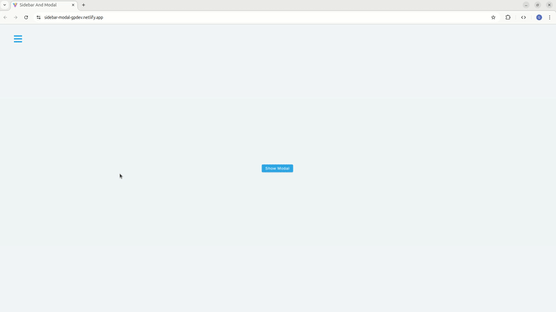
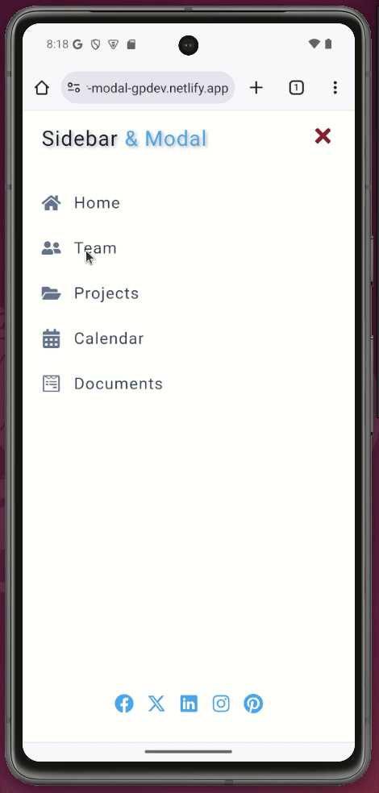

# React Sidebar & Modal Component Showcase 🎯


A modern, responsive React application showcasing interactive sidebar and modal components with smooth animations. Features a testimonial slider within the modal for enhanced user engagement. Perfect for practicing React context, state management, and responsive UI development.

## 🚀 Live Demo

**View Live on Netlify:**  
[React Sidebar & Modal Demo](https://sidebar-modal-gpdev.netlify.app/)

## 📸 Project Preview

<table align="center">
  <tr>
    <td align="center"><strong>💻 Desktop View</strong></td>
  </tr>
  <tr>
    <td align="center"></td>
  </tr>
  
  <tr>
    <td align="center"><strong>📱 Mobile View</strong></td>
  </tr>
  <tr>
    <td align="center"></td>
  </tr>
  <tr>
    <td align="center"><em>Mobile responsive view with smooth transitions</em></td>
  </tr>
</table>

## 🎨 Design Inspiration

- **Base Design:** Figma design provided by the course instructor.
  [View Original Figma Design](https://www.figma.com/file/cFyEiRb6jQdVIVK9M5eoe6/Sidebar-and-modal?node-id=0%3A1&t=sg6VSjSNK3T1Uy8P-1)
- **Base Concept:** Course exercise focused on React context and component communication
- **Custom Enhancement:** Integrated testimonial slider into modal for practical demonstration
- **Original Branding:** Custom title component replacing course assets for portfolio presentation

## ✨ Features

- **Responsive Sidebar** - Smooth slide-in/slide-out animations with transform transitions
- **Interactive Modal** - Dark overlay with centered content and testimonial slider
- **Testimonial Carousel** - Integrated react-slick slider with autoplay and fade effects
- **Global State Management** - React Context API for shared state across components
- **Mobile-First Design** - Optimized for all screen sizes with touch-friendly interactions
- **Custom Hooks** - useGlobalContext hook for easy context consumption
- **Social Media Integration** - Social links in sidebar with external linking
- **Smooth Animations** - CSS transitions and keyframe animations throughout

👥 Perfect For:

- 🏢 Admin dashboards and control panels

- 📱 Mobile app navigation systems

- 🎨 UI component libraries and design systems

- 📚 React learning projects and portfolio pieces

- 🔧 Developers needing sidebar/modal components

## 🛠️ Built With

| Tool / Library         | Purpose                             |
| ---------------------- | ----------------------------------- |
| ⚡ **Vite**            | Fast build tool & dev server        |
| ⚛️ **React 19**        | Component-based UI with hooks       |
| 📋 **React Icons**     | Comprehensive icon library          |
| 🎯 **React Context**   | Global state management             |
| 🎠 **React Slick**     | Testimonial carousel component      |
| 🎨 **CSS3**            | Custom properties, Grid, animations |
| 📜 **JavaScript ES6+** | Modern language features            |

## 🎓 Key Learning Outcomes & Implemented Concepts

### State Management & React Patterns

- **Global State with Context API** for shared sidebar/modal state
- **Custom React Hook** (useGlobalContext) for easy context consumption
- **Component Composition** with reusable Title component
- **Conditional Rendering** based on state for show/hide functionality

### Animation & Responsive Design

- **CSS Transform Animations** for sidebar slide effects
- **Smooth Transitions** for modal overlay fade effects
- **Mobile-First Responsive Design** with media queries
- **Touch-Friendly Interface** with appropriate button sizes

### Advanced Component Integration

- **Third-Party Library Integration** (react-slick carousel)
- **Dynamic Data Mapping** from external data files
- **External Link Handling** with security attributes
- **Component Lifecycle Management** with proper cleanup

### UI/UX Best Practices

- **Accessible Navigation** with semantic HTML
- **Visual Feedback** through hover effects and animations
- **Consistent Styling** with CSS custom properties
- **Cross-Browser Compatibility** with vendor prefixes

## 📦 Project Structure

```text
src/
├── components/
│   ├── Home.jsx
│   ├── Modal.jsx
│   ├── Sidebar.jsx
│   ├── Title.jsx
│   ├── ModalSlider.jsx
│   └── AppProvider.jsx
├── contexts/
│   └── AppContext.js
├── hooks/
│   └── useGlobalContext.js
├── data.jsx
├── App.jsx
└── index.css
```

## 🚀 Getting Started

### Prerequisites

- **Node.js** ≥ 18.0.0
- **npm** or **yarn** package manager

### Installation

1. Clone the repository

```bash
git clone https://github.com/pro804/React-Sidebar-Modal.git
```

2. Navigate to the project directory

```bash
cd React-Sidebar-Modal
```

3. Install dependencies

```bash
npm install
```

4. Start the development server

```bash
npm run dev
```

5. Open http://localhost:5173 to view it in the browser.

## 🔧 Available Scripts

- `npm run dev` — Runs the development server (Vite)
- `npm run build` — Builds the app for production
- `npm run preview` — Previews the production build locally

## 📄 License

This project was created for educational purposes as part of a React learning journey.
This project is licensed under the MIT License.
See the [LICENSE](LICENSE) file for details.
